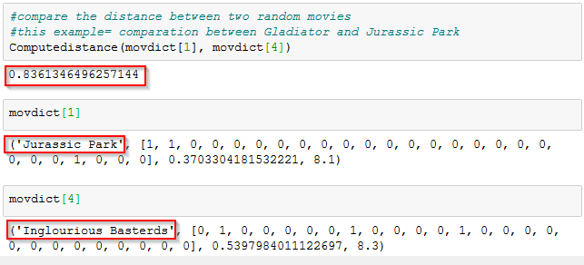

# K-Nearest-Neighbor-IMDB-Project

+ [Table of Contents](#sub-sub-heading-1)
    + [Credits](#credits)
    + [Project Goal and procedure](#project-goal-and-procedure)
    + [Code and Resources](#code-and-resources)
    + [Part 1- Scraping Data using Selenium and Scrapy](#part-1--scraping-data-using-selenium-and-scrapy)
    + [Part 2- Data Cleaning and Feature Engineering](#part-2--data-cleaning-and-feature-engineering)
    + [Part 3- KNN Model Building](#part-3--knn-model-building)
    

 ### Credits: 
 A big thank you goes to [KenJee](https://www.youtube.com/channel/UCiT9RITQ9PW6BhXK0y2jaeg), [Codebasics](https://www.youtube.com/channel/UCh9nVJoWXmFb7sLApWGcLPQ), [Krish Naik](https://www.youtube.com/user/krishnaik06), [Keith Galli](https://www.youtube.com/channel/UCq6XkhO5SZ66N04IcPbqNcw)  and to the whole [Edureka Team](https://www.youtube.com/user/edurekaIN) who put a lot of effort to teach people Data Science, Machine Learning, Statistics and a lot of other related topics for free.
 
 
### Project Goal and Procedure
* Goal: Create a model which can classify similar movies from [IMDB.com](https://www.imdb.com/), based on the rating and genre information by using the KNN Machine Learning Algorithm
* Dataset was scraped using Python, Selenium and Scrapy
* Saved results in a csv file and manipulated and worked with the data using the pandas package
* Visualization of data using seaborn and matplotlib packages
* Built a K Nearest Neighbor Model
 
### Code and Resources
* Python Version: 3.7
* Environment: Visual Studio, Jupyter Notebook
* Packages: Scrapy, Selenium, Scipy, Matplotlib, Seaborn, Numpy
 
 
 
# Part 1- Scraping Data using Selenium and Scrapy
The relevant data was extracted in two steps. In the first step I wrote a script by using selenium so that specific steps were completed automatically when the script ran.
In detail, the selenium script exists of the following instructions:
 
  * Go to Google.com
 * Search for 'IMDB' and click on the first result
 * Find the dropdown menu and click on the 'Advanced Search' button
 * Select 'Feature Film'
 * Select'TV Movie'
 * Find movies from 1990-2020
 * Find movies which have a rating from 1 to 10
 * Find movies which are Oscar nominated
 * Select just color movies
 * Select just english speaking movies
 
If you want to see how the Selenium scraper behaves by executing the mentioned instructions, just click on the icon below (you will be redirected to Google Drive- make sure you watch the video with the highest resolution) :
 

 

 
 Finally, the URL is handed over to the **Scrapy** script which took care for clickling on each result and extracted the following information:
 * movie title
 * movie year
 * movie rating
 * movie rating count
 * movie genre
 
 

 
 
 
 
 
 
 ### Output in pandas after scraping (first 5 entries):
 
  
 
 
 # Part 2- Data Cleaning and Feature Engineering
 
 After scraping the data and storing it in csv and pandas, I had to do some cleaning and modifying steps like:
 * remove unnecessary string elements
 * convert particular columns to integers and floats to make it machine readable 
 * In order to be able to create distance metrices between the movies, we need to normalize the rating counts. As a result we get back a value between '0' and '1'. '1' means that the movie has the highest rating count whereas a '0' expresses that a given movie received the smallest amount of rating compared to all the other movies.  
 * create columns for each genre by extracting information from the genre column('1' = movie falls into a specific genre, '0' = movie does not fall into a specific genre). 
 

#### The following snippet hightlights that the movie 'Guardians of the Galaxy' falls into the genres 'Action', 'Adventure', 'Comedy':

  
  
 
 # Part 3- KNN Model Building
 
In general, the K-Nearest Neighbours algorithm belongs to the supervised learning domain. That model classifies new data points based on the "distance" to similar or known data. In the daily practice, the KNN algorithm is often used in recommendation systems or in recognition technology. For example, Amazon or Netflix use such algorithms in order to recommend movies, books etc., based on the users preference.

After modifying our scraped dataset from IMDB, the next step is to build a recommendation model which is able to take one particular movie and give back for example 10 movies which are similar, based on the genre and the rating. 
 
 In the first step we define a distance metric between movies based on the meta data (information associated with the movie). Therefore we take a look on the movies genre (while a movie can have more than one genre), on the popularity of a movie (number of people who rated a movie) and on the average rating. In the next step it is necessary to create a separated column for the Movie ID and extract the rating count (how many people rated a specific movie) and the average rating (1-10). 
 
 
 
 
 Afterwards, the rating information needs to be ,,normalized". Every movie will be ,,normalized" against the range of the most popular and the least popular movie. As a result, we get back a measurement of popularity for each movie (scale= 0 (least popular movie) to 1 (most popular movie)).

In our dataset, the movie ,,The Shawshank Redemption" has the best rating count, whereas the film ,,Liberations: Fighting on Two Fronts in World War II" is the worst rated one:

Next, we need to expand the number of columns in the dataframe by adding the genres (which we scraped from IMDB in the first place) and specify for each movie in what genre category it belongs (remember that a movie can belong to multiple genres). 
The example shows that the movie ,,Guardians of the Galaxy" belongs to the genres Action, Adventure and Comedy. If a movie falls into a specific genre, the entry will be a "1", otherwise it is a "0".

After that, we build a dictionary, where Movie IDs will be mapped to the name, list of genres, popularity score (scale 0-1) and the average rating:

If you take a look inside the code, you will see what each genre corresponds to. For the purpose of our research it is not that important since we try to calculate the distance (vector of genres) to another movie. 

Afterwards, its time to calculate a distance score between two movies based on the mentioned criteria.
For that part, we use the cosine similarity metric.

For example, the similarity score of the movies "Jurassic Park" and "Inglourious Basterds" is 0.8361. The smaller the distance score, the more similiar two movies are. The mentioned score implicates that these movies are not that similar. Even if the popularity is almost the same (8.3 vs 8.1), the genre difference is the key point here.

Lets say, we want to find the 8 nearest neighbors of the movie "Django Unchained".
As a result, we get back the following 8 movies and an average rating of 8.35

# Model Limitation
As a next step, a productionization of this model can be considered. That would allow users to choose their desired movie and get back the most similar ones, without the need of working with the code.
 

